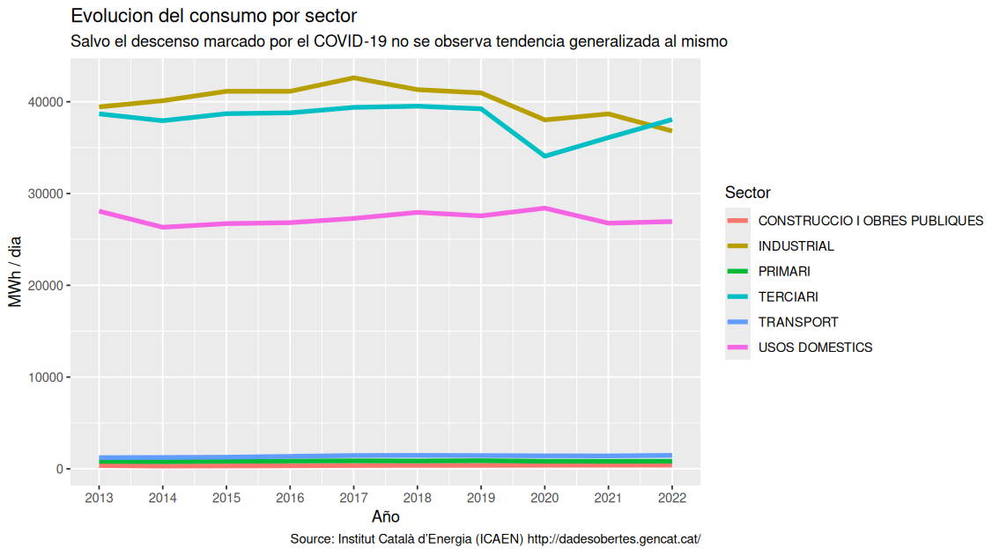

## Introduccion

Este proyecto surge como práctica de la asignatura de visualización de datos.

Siguiendo la metodología y recomendaciones de Moritz Stefaner en un [artículo en Truth & Beauty.net](https://truth-and-beauty.net/appearances/in-the-media/new-challenges-for-data-design)

> The basic set of questions I usually ask are:
>
> -   Why are we doing this?
> -   What are you hoping to achieve?
> -   Who are we targeting?
> -   How is the end product going to be used?
> -   How are we publishing?
> -   What data do we have available?
> -   Which other existing materials should we take into account?
> -   Which constraints do we have?
> -   Who is responsible for what?
> -   Who else is doing something similar?

Todas estas preguntas tienen cabida en cualquier proyecto de visualización, donde a partir de las cuales se desarrolla un proceso iterativo en el que tras cada iteración se replantean, modificando la hoja de ruta del proyecto de ser necesario

### Propósito del proyecto

-   **¿Porqué estamos haciendo esto?**

Como ya se ha mencionado en la introducción, se trata de una práctica de visualización de datos. El código empleado en realizar la práctica ha de ser publicado en la web y qué mejor que hacerlo en forma de repositorio público. De esta forma el código podrá ser reutilizado por quien lo considere necesario y ampliar el alcance del mismo.

-   **¿Qué esperamos lograr?**

Una infografía que proporcione información relevante sobre el consumo eléctrico en Catalunya.

-   **¿Quién es nuestro público?**

Cualquier persona interesada en conocer los datos de consumo eléctrico en Catalunya.

-   **¿Cómo se usará nuestra visualización?**

La infografía estará disponible públicamente en la web.

-   **¿Cómo publicaremos?**

Emplearemos una cuenta gratuita de Flourish y publicaremos en [https//public.flourish.studio](https://public.flourish.studio/visualisation/20441699/)

-   **¿Qué datos tenemos disponibles?**

Datos en abierto del dominio [gencat.cat](https://administraciodigital.gencat.cat/ca/dades/dades-obertes/inici/) publicados por el gobierno autonómico.

Del catálogo de conjuntos de datos disponibles partimos del [Consumo de energía eléctrica por municipios y sectores](https://analisi.transparenciacatalunya.cat/Energia/Consum-d-energia-el-ctrica-per-municipis-i-sectors/8idm-becu/about_data)

-   **¿Qué otros materiales deberíamos tener en cuenta?**

Otros dataset del catálogo disponible que tienen relación con el consumo eléctrico:

[Instalaciones de autoconsumo eléctrico](https://analisi.transparenciacatalunya.cat/Energia/Instal-lacions-d-autoconsum-el-ctric/2b4s-skfm/about_data)

[Instalaciones de producción de energía eléctrica](https://analisi.transparenciacatalunya.cat/Energia/Instal-lacions-de-producci-d-energia-el-ctrica-Dad/arbg-m6sq/about_data)

[Plantas solares fotovoltaicas](https://analisi.transparenciacatalunya.cat/Medi-Ambient/Plantes-solars-fotovoltaiques-a-Catalunya/ggx8-jkp4/about_data)

[Certificados de eficiencia energética de edificios](https://analisi.transparenciacatalunya.cat/Energia/Certificats-d-efici-ncia-energ-tica-d-edificis/j6ii-t3w2/about_data)

-   **¿Qué restricciones tenemos?**

    -   Las impuestas por la guía proporcionada para desarrollar la práctica

        -   Relevancia: el conjunto de datos debería ser de actualidad, significativo de interés general, y permite plantear preguntas interesantes.
        -   Dimensiones: Del orden de 1000-10000 filas y de 10-100 columnas
        -   Características: combina datos numéricos y categóricos
        -   Contiene alguna jerarquía: categoría / subcategoría

    -   Las impuestas por la herramienta de visualización.

        Flourish se basa en el uso de modelos ("templates") que se reutilizan proporcionando nuevos datos para una visualización determinada. Deberemos adecuar los datos obtenidos de las fuentes a lo esperado en los modelos previstos.

    -   El tiempo.

        Al menos dos iteraciones a realizar antes del 24 de Enero de 2025. (Tempus fugit)

-   **¿Quién es responsable de qué?**

Hasta la fecha de entrega yo, a partir de entonces se aceptan colaboraciones.

-   **¿Alguien más esta haciendo algo similar?**

Mis compañeros de asignatura, si es que eligieron el mismo cojunto de datos o temática.

### Primera iteración.

Se realiza completamente en R empleando librerías de ggplot. El código disponible en [Consum_EE_CAT.R](./Consum_EE_CAT.R) realiza diferentes plots exploratorios (histogramas, boxplot, violinplot y "bar counts") para observar las características, distribución de valores, categorías, etc. del conjunto de datos.

De ellos cabe destacar:

-   El histograma de observaciones por muncipio.

Vemos que el numero de observaciones dividido por el numero de años (eje X) coincide con el numero de sectores en el dataset. Aproximadamente el 53% (500 municipios) presentan datos para 5/6 sectores presentes en el dataset y que todos los municipios al menos consumen electricidad en dos de los sectores presentes durante toda la década.

-   El contador de observaciones por sector.

El valor del número de observaciones se ha dividido por el número de municipios, con lo que obtenemos un valor que es proporcional. Considerando que tenemos observaciones exactamente por 10 años, podemos rápidamente deducir que el 100% de los municipios consumen electricidad en el sector de servicios y uso doméstico.

También es relevante observar la presencia, en aproximadamente un 10% de municipios, del consumo de electricidad en el transporte. Dada la necesidad de reducir la emisión de CO², será interesante observar dicho sector en nuestras visualizaciones. ¿Qué municipios y que evolución ha tenido?

-   Finalmente, una gráfica de la evolución del consumo por sectores.

Donde observamos que el COVID marcó un punto de inflexión en la tendencia del consumo y que el empleado en el transporte, sector primario y construcción es insignificante frente a los otros consumos.

### Segunda iteración.

Comenzamos la segunda iteración obteniendo los datos adicionales que necesitaremos para:

-   Representar geográficamente en un mapa los municipios y comarcas de catalunya
    -   Longitud y latitud de los municipios.
    -   Mapa de geometrías de Catalunya
-   Poder comparar el consumo doméstico de unos municipios con otros.
    -   Censo municipal de habitantes de la última década.

La longitud y latitud de cada uno de los municipios la obtenemos de: [Municipios Catalunya Geo](https://analisi.transparenciacatalunya.cat/Urbanisme-infraestructures/Municipis-Catalunya-Geo/9aju-tpwc/about_data)

Los archivos GeoJson con las divisiones administrativas (provincias, comarcas y municipios) de: [Divisions administratives](https://catalegs.ide.cat/geonetwork/srv/cat/catalog.search#/metadata/divisions-administratives-v2r1-20240705). Proporcionado por el Instituto Cartográfico y Geológico de Catalunya.

Finalmente, para poder calcular el consumo energético por habitante obtenemos los datos del censo municipal, que descargamos del [Instituto Nacional de Estadística](https://www.ine.es/dynt3/inebase/index.htm?padre=525).

#### Homogeneización de los datos.

Al obtener los datos de diferentes entidades, nos encontramos con diferentes criterios a la hora de codificarlos.

-   Los datos que provienen del Insitut Cartogràfic codifican el municipio con 6 dígitos numéricos, mientras que el resto lo hacen con cinco dígitos. El INE además incluye datos agregados a la vez de que combina nombre del municipio y código en un único campo.

-   Los ficheros GeoJSON nos proporcionan la geometría de las comarcas en 2024, lo que incluye comarcas que hace una década no existian (Moianès y Lluçanès).

-   El dataset de consumos proporciona los nombres en mayúsculas, mientras que los del Institut Cartogràfic lo hacen en minúsculas.

Para poder corregir todas esas diferencias, combinar los diferentes cojuntos y obtener un fichero csv a cargar en el template de Flourish, se proporciona el script de R [Consum_EE_Flourish.R](./Consum_EE_Flourish.R)

#### Simplificación de los GeoJSON.

Flourish recomienda que los mapas de proyecciones no tengan un tamaño excesivo para asegurar que la visualización funcione de forma fluida. Para ello seguimos la guía [How-to-simplify-GeoJSON-files](https://helpcenter.flourish.studio/hc/en-us/articles/8827922078351-How-to-simplify-GeoJSON-files) . Y no solo eso, tras la carga del JSON podemos ver que el dataset no sólo proporciona las geometrías, sino otra información que puede ser de utilidad como la superficie en KM², las capitales de comarca, los nombres locales, etc . Dado que tendremos que procesar dichos ficheros para homogeneizar los códigos de municipios, una vez cargados en Flourish, los descargamos como csv y los procesamos en el script como `Comarcas-geometry.csv` y `Municipios-geometry.csv` . Posteriormente volveremos a cargarlos junto con datos numéricos a representar en el mapa.
